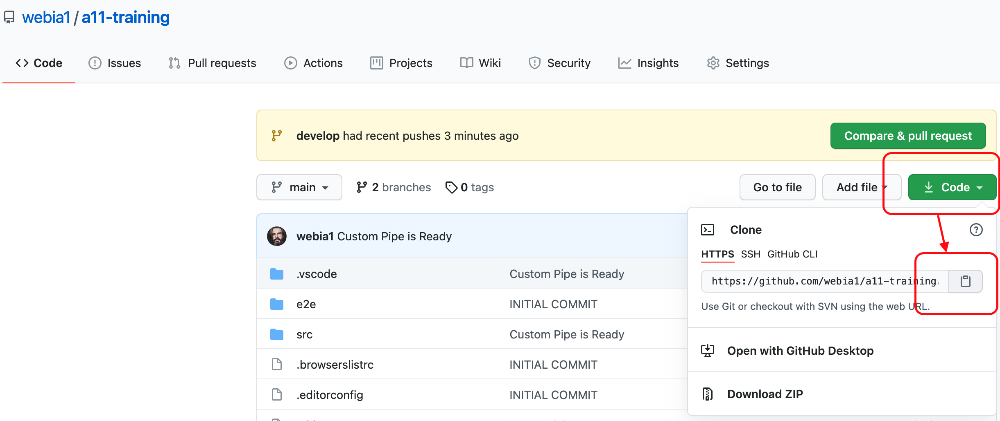

# A11 - TOF

<!-- @import "[TOC]" {cmd="toc" depthFrom=1 depthTo=6 orderedList=false} -->

<!-- code_chunk_output -->

- [A11 - TOF](#a11-tof)
  - [Steps](#steps)
    - [Angular CLI Installation](#angular-cli-installation)
    - [Create a new project](#create-a-new-project)
    - [Preparing git](#preparing-git)
      - [Delete existing `.git` folder](#delete-existing-git-folder)
    - [Initialize Git](#initialize-git)
    - [Create an empty component](#create-an-empty-component)
    - [Preparing Code Style Guides (Prettier)](#preparing-code-style-guides-prettier)
    - [Create a new route](#create-a-new-route)
    - [REST API](#rest-api)
      - [HttpClientModule](#httpclientmodule)
      - [Create a Service](#create-a-service)
      - [Implementing DarthVaderAPI](#implementing-darthvaderapi)
    - [PIPES](#pipes)
      - [Creating a Custom Pipe](#creating-a-custom-pipe)
  - [Backup - Relevant Topics](#backup-relevant-topics)
    - [JavaScript](#javascript)
      - [Imports & Exports](#imports-exports)
        - [Imports](#imports)
        - [Exports](#exports)
    - [Git](#git)
      - [Create a new branch based on current branch](#create-a-new-branch-based-on-current-branch)
      - [Create and push a branch](#create-and-push-a-branch)
      - [Clone an existing Repo from GitHub](#clone-an-existing-repo-from-github)
      - [An WorkFlow Example with git](#an-workflow-example-with-git)
    - [SOLID Principles](#solid-principles)
    - [History](#history)
      - [Import Ability](#import-ability)

<!-- /code_chunk_output -->

## Steps

### Angular CLI Installation

```shell
ng i -g @angular/cli
```

### Create a new project

```shell
ng new a11 --prefix=tof
```

### Preparing git

#### Delete existing `.git` folder

```shell
cd a11
rm -rf .git
```

### Initialize Git

```shell
git init
git add .
git commit -m "INITIAL COMMIT"
```

### Create an empty component

```shell
ng g c components/dashboard
git add .
git commit -m "Dashboard Component created"
```

### Preparing Code Style Guides (Prettier)

Create `.prettierrc` at root folder:

```json
{
  "semi": true,
  "trailingComma": "all",
  "singleQuote": true,
  "printWidth": 70,
  "tabWidth": 2
}
```

### Create a new route

> src/app/app-routing.module.ts

z.B.

```ts
const routes: Routes = [
  {
    path: '',
    component: DashboardComponent,
  },
  {
    path: 'dashboard',
    component: DashboardComponent,
  },
];
```

### REST API

> https://swapi.dev/
> Darth Vader API URL (Endpoint): http://swapi.dev/api/people/4/

#### HttpClientModule

> src/app/app.module.ts

```ts
import { HttpClientModule } from '@angular/common/http';

@NgModule({
  declarations: [AppComponent, DashboardComponent],
  imports: [
    BrowserModule,
    AppRoutingModule,
    HttpClientModule, // <---- HERE!
  ],
  providers: [],
  bootstrap: [AppComponent],
})

```

#### Create a Service

```shell
ng g s services/common
```

#### Implementing DarthVaderAPI

> src/app/services/common.service.ts

```ts
import { Injectable } from '@angular/core';
import {
  HttpClient,
  HttpErrorResponse,
  HttpResponse,
} from '@angular/common/http';
import { Observable, throwError } from 'rxjs';
import { catchError, retry } from 'rxjs/operators';

@Injectable({
  providedIn: 'root',
})
export class CommonService {
  darthVaderUrl: string = 'http://swapi.dev/api/people/4/';

  constructor(private http: HttpClient) {}

  getDarthVaderData() {
    return this.http
      .get(this.darthVaderUrl)
      .pipe(retry(3), catchError(this.handleError));
  }

  log(message: string, isImportant = false) {
    isImportant
      ? console.log(`%c${message}`, 'color:red; font-size:18px')
      : console.log(`%c${message}`, 'color:lime; font-size:18px');
  }

  private handleError(error: HttpErrorResponse) {
    if (error.error instanceof ErrorEvent) {
      // A client-side or network error occurred. Handle it accordingly.
      console.error('An error occurred:', error.error.message);
    } else {
      // The backend returned an unsuccessful response code.
      // The response body may contain clues as to what went wrong.
      console.error(
        `Backend returned code ${error.status}, ` +
          `body was: ${error.error}`,
      );
    }
    // Return an observable with a user-facing error message.
    return throwError(
      'Something bad happened; please try again later.',
    );
  }
}
```

> src/app/components/dashboard/dashboard.component.ts

```ts
import { Component, OnDestroy, OnInit } from '@angular/core';
import { Subscription } from 'rxjs';
import { CommonService } from 'src/app/services/common.service';

@Component({
  selector: 'tof-dashboard',
  templateUrl: './dashboard.component.html',
  styleUrls: ['./dashboard.component.scss'],
})
export class DashboardComponent implements OnInit, OnDestroy {
  getDarthVaderData: Subscription = new Subscription();
  darthVaderData: unknown;

  constructor(private cs: CommonService) {}

  ngOnInit(): void {
    this.getDarthVaderDataFromService();
  }

  getDarthVaderDataFromService() {
    this.cs.log('getDarthVaderDataFromService has been invoked');

    this.getDarthVaderData = this.cs
      .getDarthVaderData()
      .subscribe(
        (darthVaderDataFromService) =>
          (this.darthVaderData = darthVaderDataFromService),
      );
  }

  ngOnDestroy() {
    if (this.getDarthVaderData) {
      this.getDarthVaderData.unsubscribe();
    }
  }
}
```

> src/app/components/dashboard/dashboard.component.html

```html
<p>My DarthVaderData:</p>

<pre><code>{{ darthVaderData | json }}</code></pre>
```

### PIPES

Angular provides built-in pipes for typical data transformations, including transformations for internationalization (i18n), which use locale information to format data. The following are commonly used built-in pipes for data formatting:

`DatePipe`: Formats a date value according to locale rules.
`UpperCasePipe`: Transforms text to all upper case.
`LowerCasePipe`: Transforms text to all lower case.
`CurrencyPipe`: Transforms a number to a currency string, formatted according to locale rules.
`DecimalPipe`: Transforms a number into a string with a decimal point, formatted according to locale rules.
`PercentPipe`: Transforms a number to a percentage string, formatted according to locale rules.

#### Creating a Custom Pipe

```shell
ng g pipe pipes/dennis
```

> src/app/pipes/dennis.pipe.ts

```ts
import { Pipe, PipeTransform } from '@angular/core';

@Pipe({
  name: 'dennis',
})
export class DennisPipe implements PipeTransform {
  transform(value: any, ...args: unknown[]): unknown {
    console.log('ARGS: ', args[0]);
    return value + args[0] + '  -- Grüße vom Dennis';
  }
}
```

> src/app/components/dashboard/dashboard.component.html

```html
<p>{{ someText | dennis: 'Hallo' }}</p>
```

### DATA EXCHANGE BETWEEN COMPONENTS

<https://github.com/webia1/Frontend-Ecosystem/tree/main/Angular/Documentation/Data-Sharing-Between-Components>

## Backup - Relevant Topics

### JavaScript

#### Imports & Exports

##### Imports

```javascript
import name from "module-name";
import * as name from "module-name";
import { member } from "module-name";
import { member as alias } from "module-name";
import { member1 , member2 } from "module-name";
import { member1 , member2 as alias2 , [...] } from "module-name";
import defaultMember, { member [ , [...] ] } from "module-name";
import defaultMember, * as alias from "module-name";
import defaultMember from "module-name";
import "module-name";
```

##### Exports

```javascript
export { name1, name2, …, nameN };
export { variable1 as name1, variable2 as name2, …, nameN };
export let name1, name2, …, nameN; // oder: var
export let name1 = …, name2 = …, …, nameN; // oder: var, const

export default expression;
export default function (…) { … } // oder: class, function*
export default function name1(…) { … } // oder: class, function*
export { name1 as default, … };

export * from …;
export { name1, name2, …, nameN } from …;
export { import1 as name1, import2 as name2, …, nameN } from …;
```

### Git

#### Create a new branch based on current branch

```shell
git checkout -b develop
```

#### Create and push a branch

```shell
git push -u origin develop
```

#### Clone an existing Repo from GitHub



```shell
git clone https://github.com/webia1/a11-training.git
```

#### An WorkFlow Example with git

<https://jeffkreeftmeijer.com/git-flow/>

### SOLID Principles

> <https://en.wikipedia.org/wiki/SOLID>

### History

#### Import Ability

SO: <https://stackoverflow.com/questions/950087/how-do-i-include-a-javascript-file-in-another-javascript-file>
